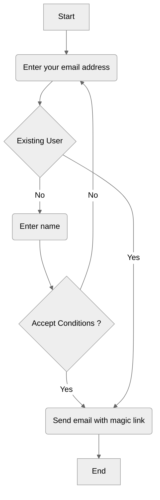
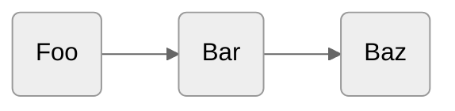

# One way ticket

---

## Problem

Given a codeblock that starts with 3 `backticks` and ends with 3 `backticks`
Run the check function at one direction, if it hits 3 backticks, check the line
If the line has code identifier, then check the other direction
If checks for only 3 `backticks` == true, execute the function,
otherwise execute something else
